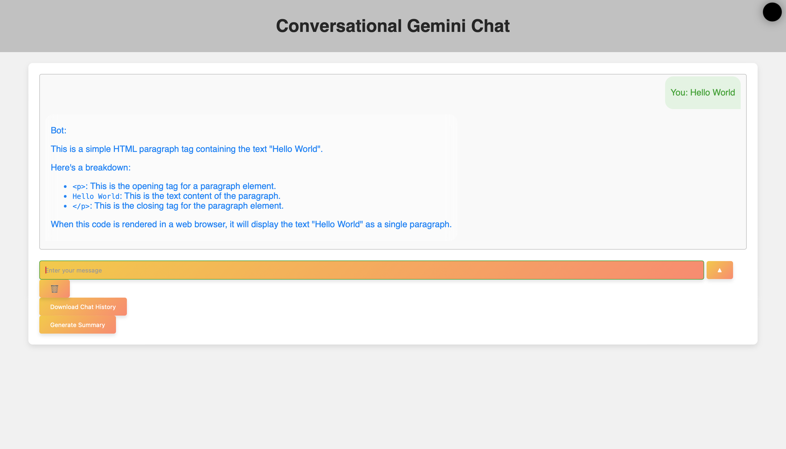

# GitHub Codespaces ♥️ Flask

Welcome to your shiny new Codespace running Flask! We've got everything fired up and running for you to explore Flask.

You've got a blank canvas to work on from a git perspective as well. There's a single initial commit with the what you're seeing right now - where you go from here is up to you!

Everything you do here is contained within this one codespace. There is no repository on GitHub yet. If and when you’re ready you can click "Publish Branch" and we’ll create your repository and push up your project. If you were just exploring then and have no further need for this code then you can simply delete your codespace and it's gone forever.

To run this application:

```
flask --debug run
```

## Obtaining a Gemini API Key from Google AI Studio

To run this project, you need to obtain a Gemini API Key from Google AI Studio. Follow these steps:

1. Go to the [Google AI Studio](https://ai.google.com/studio) website.
2. Sign in with your Google account.
3. Navigate to the "API Keys" section.
4. Click on "Create API Key" and follow the instructions.
5. Copy the generated API Key.

## Setting the GEMINI_API Environment Variable

After obtaining the Gemini API Key, you need to set it as an environment variable. Follow these steps:

### On Windows

1. Open Command Prompt.
2. Run the following command:
   ```
   setx GEMINI_API "YOUR_API_KEY"
   ```
3. Restart your Command Prompt or IDE to apply the changes.

### On macOS and Linux

1. Open Terminal.
2. Run the following command:
   ```
   export GEMINI_API="YOUR_API_KEY"
   ```
3. Add the above line to your shell configuration file (e.g., `.bashrc`, `.zshrc`) to make it persistent.

## Running the Flask Application

To run the Flask application, follow these steps:

1. Ensure you have Python and Flask installed on your system.
2. Set the `GEMINI_API` environment variable as described above.
3. Navigate to the project directory in your terminal.
4. Run the following command to start the Flask application:
   ```
   flask --debug run
   ```
5. Open your web browser and go to `http://localhost:5000` to access the application.

## Visual Improvements

We have made several visual improvements to the chat application to enhance its appearance and user experience.

### New Styles and Layout

- Updated the background color to a gradient for a more modern look.
- Added padding and margin to the chat messages for better spacing.
- Updated the button styles to be more visually appealing.
- Added hover effects to the buttons for better interactivity.
- Updated the font styles for a more modern look.

### Updated HTML Structure

- Updated the structure of the chat container for better layout.
- Added a header section with a logo or title for better branding.
- Updated the form structure for better alignment and spacing.
- Added a footer section with additional information or links.

### Screenshots

Here are some screenshots of the improved chat application:


## New Feature: Summary Generation

We have added a new feature to the chat application that allows users to generate a summary of their chat history.

### How to Use the Summary Generation Feature

1. Engage in a conversation with the chat model.
2. Once the model has responded, a "Generate Summary" button will appear below the chat form.
3. Click the "Generate Summary" button to request a summary of the chat history.
4. The summary will be generated using the Gemini API and displayed in the chat container.

### Technical Details

- The summary generation feature is implemented in `app.py`, `templates/index.html`, `static/main.css`, and `README.md`.
- A new route `/generate-summary` is added to handle summary generation requests.
- The Gemini API is used to generate a summary of the chat history.
- The summary is returned as a JSON response and displayed in the chat container.


## New Animations

We have added subtle animations to the chat application to enhance the user experience without being too distracting.

### Added Animations

- **Chat Messages**: Added a fade-in effect to the chat messages for a smoother appearance.
- **Stats Page Elements**: Added a slide-in effect to the stats page elements for a more dynamic look.
- **Header and Footer**: Added a fade-in effect to the header and footer sections for a more cohesive design.

### Technical Details

- The animations are implemented in `static/main.css`.
- The HTML structure in `templates/index.html` and `templates/stats.html` has been updated to include the new animations.
- The animations are designed to be subtle and enhance the overall user experience without being too distracting.

### Screenshots

Here are some screenshots of the new animations:


## New Feature: Display Latest User Messages and Bot Responses

We have added a new feature to the stats page that displays the latest user messages and bot responses.

### How to Use the Latest Messages Feature

1. Engage in a conversation with the chat model.
2. Navigate to the stats page to view the latest user messages and bot responses.
3. The latest messages will be displayed in a list format, showing the most recent interactions.

### Technical Details

- The latest messages feature is implemented in `app.py`, `templates/stats.html`, `static/main.css`, and `README.md`.
- The `/stats` endpoint in `app.py` is updated to include the latest user messages and bot responses.
- A new section is added to `templates/stats.html` to display the latest messages.
- JavaScript is added to `templates/stats.html` to fetch and display the latest messages.
- Styles are added to `static/main.css` to style the new section displaying the latest messages.

### Screenshots

Here are some screenshots of the latest messages feature:


## New Feature: Download Chat History

We have added a new feature to the chat application that allows users to download their chat history.

### How to Use the Download Chat History Feature

1. Engage in a conversation with the chat model.
2. Once the model has responded, a "Download Chat History" button will appear below the chat form.
3. Click the "Download Chat History" button to download the chat history as a text file.

### Technical Details

- The download chat history feature is implemented in `app.py`, `templates/index.html`, `static/main.css`, and `README.md`.
- A new route `/download-chat-history` is added to handle chat history download requests.
- The chat history is converted to a text file and sent as a response.
- The text file is downloaded to the user's device.

### Screenshots

Here are some screenshots of the download chat history feature:


## Dark Mode Toggle

We have added a dark mode toggle feature to the chat application.

### How to Use the Dark Mode Toggle Feature

1. Click the circle in the top right corner of the screen to toggle dark mode.
2. The chat application will switch between light mode and dark mode.

### Technical Details

- The dark mode toggle feature is implemented in `templates/index.html`, `templates/stats.html`, `static/main.css`, and `README.md`.
- A circle is added to the top right corner of the screen to toggle dark mode.
- The dark mode styles are applied to the chat application.

### Screenshots

Here are some screenshots of the dark mode toggle feature:


## Typing Indicator

We have added a typing indicator to the chat application to show when the model is generating a response.

### How to Use the Typing Indicator

1. Engage in a conversation with the chat model.
2. When the model is generating a response, a typing indicator will appear below the chat container.
3. The typing indicator will disappear once the model has responded.

### Technical Details

- The typing indicator is implemented in `templates/index.html`, `static/main.css`, and `README.md`.
- A typing indicator is added below the chat container to show when the model is generating a response.
- The typing indicator is displayed and hidden using JavaScript.

### Screenshots

Here are some screenshots of the typing indicator:


## Markdown Conversion for Messages and Responses

We have added markdown conversion for user messages and bot responses to enhance the formatting of the chat messages.

### How to Use the Markdown Conversion Feature

1. Engage in a conversation with the chat model.
2. Enter your message using markdown syntax.
3. The message and response will be displayed with the appropriate formatting.

### Technical Details

- The markdown conversion feature is implemented in `app.py` and `README.md`.
- User messages and bot responses are converted to markdown using the `markdown` library.
- The converted messages are displayed in the chat container.

### Demo
